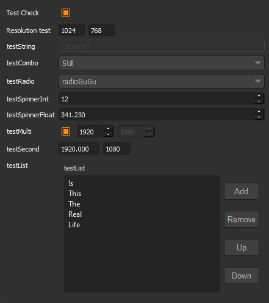

.. _developing_extractors:

Developing Extractors
=====================

The most common use case for extractors is to export data from a DCC to be used in another tool.

However, an extractor doesn't necessarily have to 'extract' anything. It can be used to perform any kind of operation on the data, such as creating a report or sending an email.

Hello World
-----------

Below is an example of an extractor that simply prints "Hello World!" to the console.

.. code-block:: python

    from tik_manager4.dcc.extract_core import ExtractCore

    # The Collector will only collect classes inherit ExtractCore
    class HelloWorld(ExtractCore):
        """Print hello world."""

        nice_name = "Hello World"
        color = (0, 0, 255)
        optional = False

        def _extract_default(self):
            """Extract method for any non-specified category"""
            print("************")
            print("Hello World!")
            print("************")

In this example, we have created a class called `HelloWorld` that inherits `ExtractCore`. 
This way, the Collector will be able to find and execute it.

We have defined the nice_name and color attributes. These are used to display the extractor in the UI.

The `optional` attribute is used to define whether the extractor is optional. If it is set to True, 
a checkbox will appear in the publisher UI next to the extractor, allowing the user to skip this extractor.

Finally, we have overridden the `_extract_default` method. This method will be called when the category is not specified.
In other words, this extractor will perform the same action regardless of the category.

Saving this code into a .py file and placing it in the extract folder of the relevant DCC 
(in this example, any DCC will work) will make it available to the Tik Manager.

.. warning::

    An extractor will be available to a category ONLY if it is assigned from the settings. For more information on how to assign 
    extractors to categories, please refer to the :ref:`category_definitions`.

.. tip::

    The ExtractCore class already wraps the _extract_default method with a try-except block, which will catch any exceptions.
    Giving the chance to the user see the error message in the UI and proceed with the remaining extractors and publishing if
    the user decides to do so.

.. collapse:: Detailed Explanation

    
    Import the ExtractCore class from the tik_manager4.dcc.extract_core module.

    .. code-block:: python

        from tik_manager4.dcc.extract_core import ExtractCore

    Make sure the Extractor class inherits the ExtractCore class.

    .. code-block:: python

        class HelloWorld(ExtractCore):

    Define the nice_name attribute. This attribute is used to display the extractor in the UI.

    .. code-block:: python

        nice_name = "Hello World"

    Define the color attribute. This attribute is used to color the extractor in the UI.

    .. code-block:: python

        color = (0, 0, 255)
    
    Define the optional attribute. This attribute is used to define whether the extractor is optional.
    The default value is False.

    .. code-block:: python

        optional = False

    Override the _extract_default method. This method will be called when the category is not specified.

    .. code-block:: python

        def _extract_default(self):
            print("************")
            print("Hello World!")
            print("************")

--------------------------

Selective Extraction for Categories
~~~~~~~~~~~~~~~~~~~~~~~~~~~~~~~~~~~

Extractors can be category-sensitive, meaning that the same extractor can behave differently depending on the category. 
For example, let's say we want to print "Hello Animation World!" only when the category is "Animation."

.. code-block:: python

    from tik_manager4.dcc.extract_core import ExtractCore

    # The Collector will only collect classes inherit ExtractCore
    class HelloWorld(ExtractCore):
        """Print hello world."""

        nice_name = "Hello World"
        color = (0, 0, 255)

        def __init__(self):
            super().__init__()
            self.category_functions = {"Animation": self._extract_animation}

        def _extract_default(self):
            """Extract method for any non-specified category"""
            print("************")
            print("Hello World!")
            print("************")

        def _extract_animation(self):
            """Extract method for Animation category"""
            print("************")
            print("Hello Animation World!")
            print("************")
    
In this example, we have added a new method called `_extract_animation`. 
We map the category to the method in the `__init__` method by setting the `category_functions` key.

The `Collector` will call the `_extract_animation` method when the category is "Animation" and the `_extract_default` method for any other categories.

.. collapse:: Detailed Explanation

    We need to define the category_functions dictionary in the __init__ method.
    The key is the category name, and the value is the method that will be called when the category is specified.

    .. code-block:: python

        def __init__(self):
            super().__init__()
            self.category_functions = {"Animation": self._extract_animation}

    Define the _extract_animation method. This method will be called when the category is "Animation".

    .. code-block:: python

        def _extract_animation(self):
            print("************")
            print("Hello Animation World!")
            print("************")

-------------------------

Saving Files
~~~~~~~~~~~~

Now, let's enhance our example with a more practical task. Suppose we want to publish a .txt file containing our message.

.. code-block:: python

    from tik_manager4.dcc.extract_core import ExtractCore

    # The Collector will only collect classes inherit ExtractCore
    class HelloWorld(ExtractCore):
        """Save hello world text."""

        nice_name = "Hello World"
        color = (0, 0, 255)

        def __init__(self):
            super().__init__()
            self.category_functions = {"Animation": self._extract_animation}
            self.extension = ".txt"

        def _extract_default(self):
            """Extract method for any non-specified category"""
            file_path = self.resolve_output()
            with open(file_path, "w") as file:
                file.write("Hello World!")

        def _extract_animation(self):
            file_path = self.resolve_output()
            with open(file_path, "w") as file:
                file.write("Hello Animation World!")

In this example, we have added the `extension` variable. This variable defines the file extension of the output file.
We have also utilized the `resolve_output` method. This method returns the path where the file should be saved.

.. collapse:: Detailed Explanation

    Define the extension attribute. This attribute is used to define the file extension of the output file.

    .. code-block:: python

        extension = ".txt"

    resolve_output is getting inherited from the ExtractCore class. This method returns the path where the file should be saved.

    .. code-block:: python

        file_path = self.resolve_output()

-------------------------

UI Elements
~~~~~~~~~~~

In some cases, we may need to draw UI elements to obtain user input. 
For instance, let's say we want the user to define the message to be saved in the .txt file.

.. code-block:: python

    from tik_manager4.dcc.extract_core import ExtractCore

    # The Collector will only collect classes inherit ExtractCore
    class HelloWorld(ExtractCore):
        """Save hello world text."""

        nice_name = "Hello World"
        color = (0, 0, 255)

        def __init__(self):
            global_exposed_settings = {
                "message": {
                    "type": "string",
                    "value": "Hello World!",
                    "tooltip": "Message to be saved in the .txt file."
                }
            }
            exposed_settings = {
                "Animation": {
                    "emoji": {
                        "type": "combo",
                        "value": ":)",
                        "items": [":)", ":(", ":D", ":P"],
                        "tooltip": "Emoji to be added at the end of the message."
                    },
                }
            }
            super().__init__(exposed_settings=exposed_settings, global_exposed_settings=global_exposed_settings)
            self.category_functions = {"Animation": self._extract_animation}
            self.extension = ".txt"

        def _extract_default(self):
            """Extract method for any non-specified category"""
            file_path = self.resolve_output()
            text_to_save = self.global_settings.get("message")
            with open(file_path, "w") as file:
                file.write(text_to_save)

        def _extract_animation(self):
            file_path = self.resolve_output()
            base_text = self.global_settings.get("message")
            anim_settings_obj = self.settings.get("Animation")
            emoji = anim_settings_obj.get("emoji")
            text_to_save = f"{base_text} {emoji}"
            with open(file_path, "w") as file:
                file.write(text_to_save)

In this example, we define two dictionaries and feed them into the base class.

- The `exposed_settings` is for specific settings per defined category.
- The `global_exposed_settings` specifies settings common for all categories.

Each key in the global_exposed_settings dictionary represents a row in the extractor's layout. 
The keys in the exposed_settings dictionary represent categories, where each value is another dictionary representing a row in the extractor's layout.

The Tik Manager employs the same UI definition methodology across settings, metadata, and extractor UI.

.. note:: 

    Any exposed settings (global or not) default value can be overridden with a metadata with
    the same key. For more information on metadata, please refer to the :ref:`metadata` section in the user guide.

Bundles
~~~~~~~

In some cases, we may want to create a bundle of files instead of a single file.

.. code-block:: python

    from pathlib import Path
    from tik_manager4.dcc.extract_core import ExtractCore

    # The Collector will only collect classes inherit ExtractCore
    class HelloWorld(ExtractCore):
        """Save hello world text."""

        nice_name = "Hello World"
        color = (0, 0, 255)
        optional = True
        bundled = True

        def _extract_default(self):
            """Extract method for any non-specified category"""
            bundle_directory = Path(self.resolve_output())
            bundle_directory.mkdir(parents=True, exist_ok=True)
            message_file_path = bundle_directory / "message.txt"
            info_file_path = bundle_directory / "info.txt"
            message_context = "Hello World of Bundled Extractor!"
            info_context = "This is the info file for the Hello World Extractor."
            with open(message_file_path, "w") as file:
                file.write(message_context)
            with open(info_file_path, "w") as file:
                file.write(info_context)

In this example, we have set the `bundled` attribute to `True`. 
This informs the Collector that this extractor will create a bundle, 
and `self.resolve_output()` will return a directory path instead of a file path.

-------------------------

.. _metadata_access:

Metadata access
~~~~~~~~~~~~~~~

It is possible to access the sub-project metadata from the extractor.

.. code-block:: python

    from tik_manager4.dcc.extract_core import ExtractCore

    # The Collector will only collect classes inherit ExtractCore
    class HelloWorld(ExtractCore):
        """Print hello world."""

        nice_name = "Hello World"
        color = (0, 0, 255)
        optional = False

        def _extract_default(self):
            """Extract method for any non-specified category"""
            mode = self.metadata.get_value("mode")
            print("************")
            print(f"Hello {mode} World!")
            print("************")

This simple example demonstrates how to access the metadata value named "mode" and use it in the extractor.
In this case, if the subproject that we are publishing from is and asset it will print "Hello asset World!".
If it is a shot it will print "Hello shot World!".

Miscellaneous
~~~~~~~~~~~~~

set_message method can be used to deliver a message to the user when they click the extractor icon button. 
(This circle button is located next to the extractor name in the UI.)

As a use case example, it can be used in the __init__ method to inform the user about the extractor's purpose.

.. code:: python

    def __init__(self):
        super().__init__()
        self.set_message("This extractor will print 'Hello World!' to the console.")    

UI definition Rules
-------------------

Tik Manager uses a dictionary to define the layout of the UI elements.
The goal is to allow TDs a framework that they can create unified UIs across different DCCs without writing any UI code.

Under the hood, the UI items are getting populated on a form layout.
Each key in the dictionary represents a row in the layout.

Available dictionary keys:
    - display_name: The name displayed on the UI.
    - type: The type of UI element. Refer to the list of :ref:`Availabe Data Types`
    - value: The default value of the UI element.
    - items: Items populated in a `list` widget. Compatible with `combo`, `list`, and `dropList` types.
    - tooltip: Tooltip for the UI element.
    - disables: List of UI elements disabled or enabled based on this element's value.
        - Format: List of lists where each sublist contains two elements:
            1. Condition under which the UI element is disabled.
            2. Name of the element to be disabled.
    - minimum: Minimum value for the UI element. Applies to `integer` and `float` types.
    - maximum: Maximum value for the UI element. Applies to `integer` and `float` types.
    - placeholder: Placeholder text for the UI element. Applies to `string` type.
    - object_name: Name of the widget object to be created.

Among these keys, only `type` and `value` are mandatory. 
However, if the `items` key is not defined for the `combo` type, the widget will have only one item with the `value` key, which may not be very useful.

Here is an example of a layout definition and how it will look:

.. code-block:: python

    {
    "testCheck: ": {
        "display_name": "Test Check",
        "type": "boolean",
        "value": True,
        "disables": [
        [True, "testString"]
        ]
    },
    "resolutionTest": {
        "display_name": "Resolution test",
        "type": "vector2Int",
        "value": [1024, 768]
    },
    "testString": {
        "type": "string",
        "value": "",
        "placeholder": "(Optional)"
    },
    "testCombo": {
        "type": "combo",
        "items": [
        "Superman",
        "Still",
        "Walking"
        ],
        "value": "Still"
    },
    "testRadio": {
        "type": "combo",
        "items": [
        "radioGa",
        "radioGu",
        "radioGuGu"
        ],
        "value": "radioGuGu",
        "disables": [
        [
            0,
            "testSpinnerInt"
        ]
        ]
    },
    "testSpinnerInt": {
        "type": "spinnerInt",
        "value": 12,
        "minimum": 0,
        "maximum": 100
    },
    "testSpinnerFloat": {
        "type": "spinnerFloat",
        "value": 341.23,
        "minimum": 0.0,
        "maximum": 999.9
    },
    "testMulti": {
        "type": "multi",
        "value": {
        "override": {
            "type": "boolean",
            "value": True,
            "object_name": "resolution_override",
            "disables": [
            [
                False,
                "resolutionX"
            ],
            [
                True,
                "resolutionY"
            ]
            ]
        },
        "resolutionX": {
            "type": "spinnerInt",
            "value": 1920,
            "minimum": 1,
            "maximum": 999999
        },
        "resolutionY": {
            "type": "spinnerInt",
            "value": 1080,
            "minimum": 1,
            "maximum": 999999,
            "object_name": "resolutionY"
        }
        }
    },
    "testSecond": {
        "type": "multi",
        "value": {
        "multiX": {
            "type": "float",
            "value": 1920,
            "minimum": 1,
            "maximum": 999999
        },
            "multiY": {
                "type": "integer",
                "value": 1080,
                "minimum": 1,
                "maximum": 999999
            }
        }
    },
    "testList": {
        "type": "list",
        "value": ["Is", "This", "The", "Real", "Life"]
    }
    }

.. _Availabe Data Types:

Available Data Types
~~~~~~~~~~~~~~~~~~~~

- **boolean**: Single checkbox.
- **string**: Line text input.
- **combo**: Dropdown menu (items should be provided with `items` key).
- **integer**: Integer value field (no arrows).
- **float**: Float value field (no arrows).
- **spinnerInt**: Integer spinner.
- **spinnerFloat**: Float spinner.
- **list**: List of strings (Creates a list widget with add, remove, up, and down buttons).
- **dropList**: List widget which accepts drops.
- **categoryList**: Special list widget for category selection.
- **validatedString**: Custom QLineEdit widget to validate entered values.
- **vector2Int**: Vector input with 2 integer fields.
- **vector2Float**: Vector input with 2 float fields.
- **vector3Int**: Vector input with 3 integer fields.
- **vector3Float**: Vector input with 3 float fields.
- **pathBrowser**: Path definition widget with browse button for folders.
- **fileBrowser**: Path definition widget with browse button for files.
- **subprojectBrowser**: Browser widget for Tik Manager sub-projects.
- **multi**: If this type is selected, the `value` key should be a list of dictionaries. Each dictionary must have `type` and `value` keys similar to the main dictionary. This will create a nested layout.
- **group**: Similar to `multi`, but the nested layout will be grouped with a separator.
