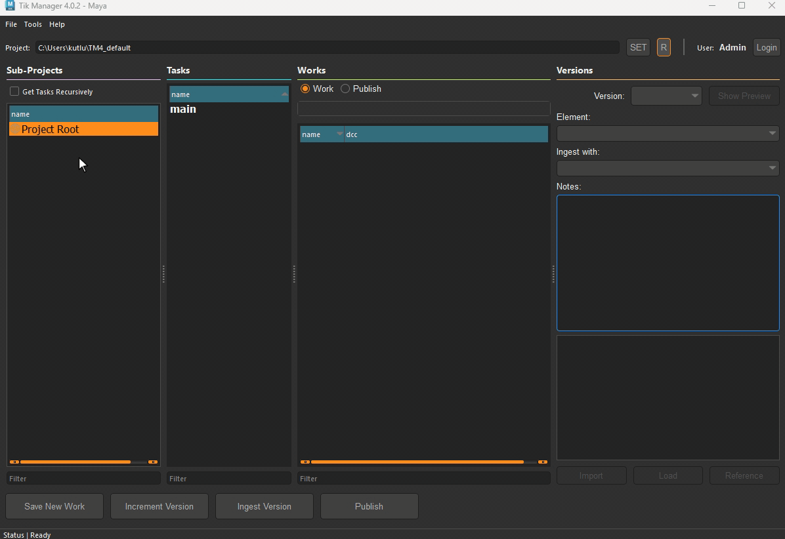
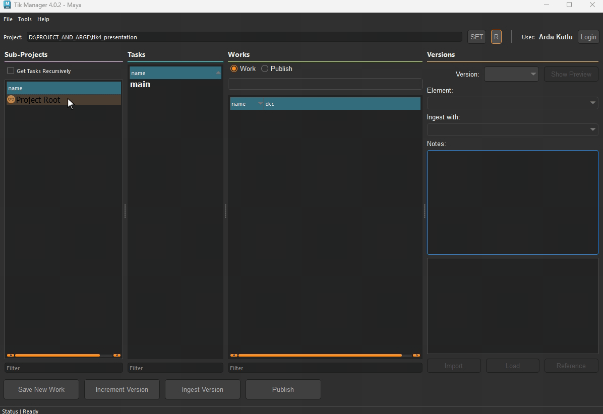
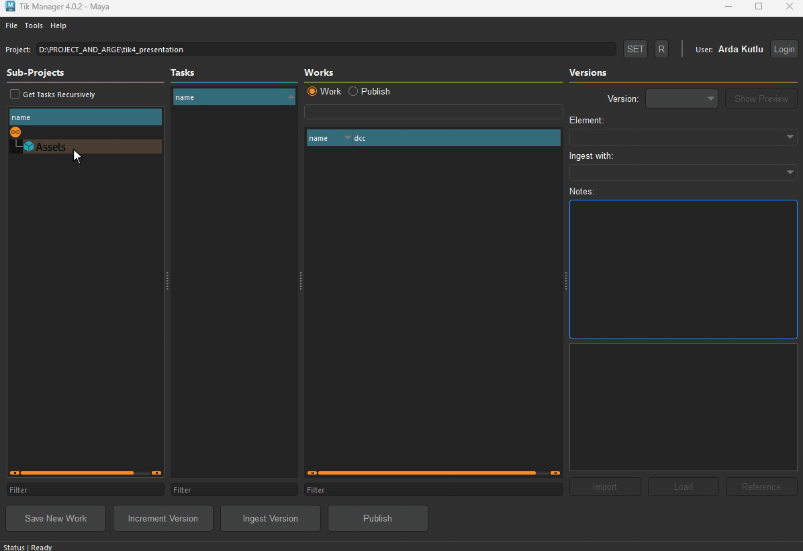
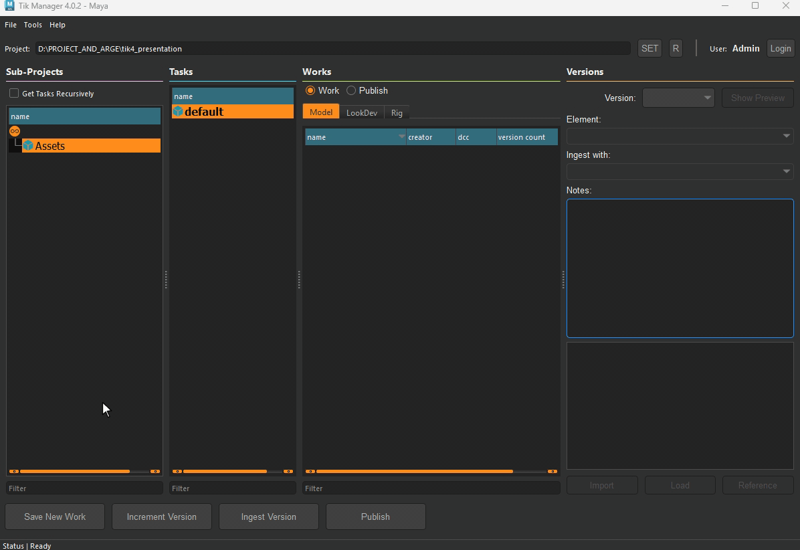
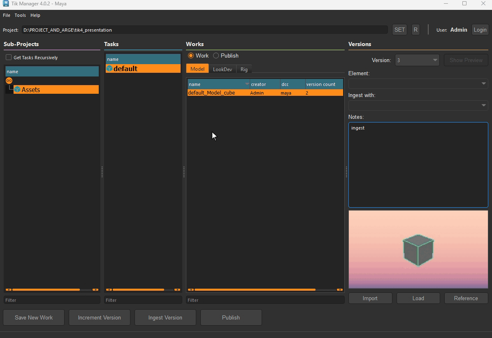

Getting Started
===============

Defining Common Folder
-----------------------
On first launch, users will be asked to define a **common folder**.

The purpose of this folder is to share templates and user data between different users of the application.
Therefore, it is important to define a folder that is accessible to all users.

**Common Folder** can be changed at any time from `File Menu -> Settings -> User`.

Adding Users
------------
Users in Tik Manager4 are individuals who will be working on the project, such as artists, supervisors, and producers.
There are four different levels of permissions for users:

- **Observer (Level 0)**: Can only view projects and contents but cannot create or modify any data.
- **Generic (Level 1)**: Can save works, versions, and perform publishes. Can delete only their own data.
- **Experienced (Level 2)**: Can do everything Generic can do, plus create or edit sub-projects and tasks.
- **Admin (Level 3)**: Has full control over the project, including adding new users and deleting any data.

Creating Project
----------------
1. In the Tik Manager4 main UI, go to `File Menu -> Create New Project` to start a new Tik Manager4 project.
2. Browse to where you want the Project folder to reside.
3. Define a Project Name.
4. Choose a template to start with. These are just presets for sub-project structures and initial metadata.
5. Define the root properties by enabling available metadata if needed.

.. tip::

    Metadata defined at the root level will be inherited by all sub-projects unless overridden. It's recommended to set values such as FPS at the root, as they will apply to most of the project.

.. note::

    Each project can have its list of metadata. Check the :ref:`settings` area to learn more about how to define metadata.

Creating Sub-Projects
---------------------
Sub-Projects are the primary building blocks of Tik Manager4, serving as containers for tasks and other sub-projects.
Depending on project requirements, a sub-project can be in shot, asset, or global mode.

.. note::

    **Mode** is simply another metadata that will be inherited or overridden by the sub-projects.

In order to create a sub-project, simply right-click on the project root or any sub-project and select `Create Sub-Project`.

.. hint::

    There is no requirement of creating Asset or Shot sub-projects. It is just a way to organize the tasks and assets.
    For very simple projects, we don't even need to create a sub-project. We can directly create tasks under the root project.

.. attention::

    Creating a new sub-project requires level 2 (Experienced) or above permissions.

Creating Tasks
--------------
Tasks are containers for all work performed by artists.
Each task can have different categories, depending on whether it belongs to a shot, asset, or global sub-project.

In order to create a new task, right-click on the project root or any sub-project and select `New Task` from the context menu.

From the pop-up window, define the task name and define the available categories for that task.

.. attention::

    Creating a new task requires level 2 (Experienced) or above permissions.

Creating Work
-------------
Work is the final container for the actual work performed by artists. 
This is same thing as **Base Scene** in Tik Manager v3.

Each Work must contain at least a single version. That means that when we first time create a **Work**,
we must also create the initial **Version** with it.

Increment & Ingest Version
--------------------------
Once a work is created, artists can start creating versions of their work.

The difference between **Increment Version** and **Ingest Version** is that the former is used to 
create a new version from the work **currently open in the scene**, while the latter is used to 
create a new version into the selected work container.

In the below example, we are first iterating a version from the currently open scene and then
iterating another version into the selected work container.

This is essentially the same behaviour since the currently open scene and selected work container are the same.

.. image:: images/Ingest_and_increment.gif

Publish
-------
Publishing is the process of making a version available to other users.

Publishing is a three-step process:
- Before the publish, the scene gets validated to ensure that it meets the project standards.
- The elements participating in the publish are defined and extracted. This can be a single file, collection of files or any custom function defined by the TDs.
- A publish record is created and stored in the database.

In the below example, we are publishing a version of a work with project-wide defined validators and extractors.

.. note:: 

    See the :ref:`settings` section to learn more about how to define existing validators and extractors to categories.

.. attention::
    If you are a TD or developer, refer to :ref:`adding_validators` and :ref:`adding_extractors` sections to learn more about how to define custom validators and extractors.