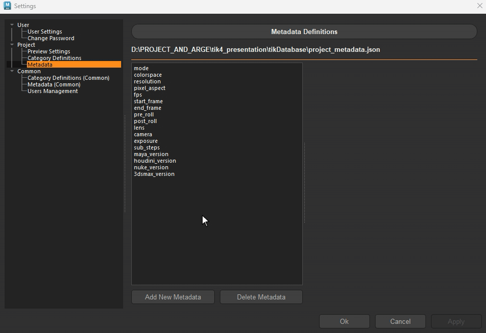

.. _projects_settings:

Project
=======

Project section contains settings that are specific to the currently set project.
This area is only accessible to users with **Admin** permission level.

There are 3 sub-sections in the Project section:

- Preview Settings
- Category Definitions
- Metadata

Preview Settings
~~~~~~~~~~~~~~~~

.. image:: ../images/settings_preview.gif

.. note:: 
    *Not all of the settings listed in here available to all DCCs.*

.. _category_definitions:

Category Definitions
~~~~~~~~~~~~~~~~~~~~

This section is used to define the **Avaliable** categories for the project.
When a new task is created, only the categories defined here will be available for selection.

In addition to the category name, admins can define **Validations** and **Extracts** for each category from here.

**Adding a New Category:**
1. Click on the `Add New Category` button.
2. Enter the name of the category.
3. Click on the `Add` button.
4. Define the type of the category - Leave it blank to make it available to all types.

.. note::

    **Validations** are used to sanity check the data (usually scene) before publishing. TDs can define custom validators easily using the template provided. All validations are appear in the *add list* automatically.

.. note:: 

    **Extracts** are essential parts of publishes. They extract data and store it as an element along with the publish. Extracts can vary from a simple file copy to a complex data extraction from the scene. All extracts are appear in the *add list* automatically.

.. hint:: 

    An extract can produce a single file or a folder (bundle) with multiple files. An extract can also be used for other purposes such as sending a file to a server or dispatching an e-mail.

.. hint:: 

    Defining a category type will make it available only for that type of sub-projects. 
    For example, if we define a category as **asset**, it will only be available for the **asset tasks**.
    Leaving it blank will make it available for any task types.

**Adding Validations and Extracts:**

1. Select the category from the list.
2. Click on the `+` button next to the validation or extract area.
3. Select the validation(s) or extract(s) from the list.

.. image:: ../images/settings_category_definitions.gif

.. attention::

    In the lists, **ALL** validations and extracts will appear for **ALL** available DCCs. However, during publish, depending on the DCC the not applicable ones will be pruned.
    For example, we can define *png* extract for the model category. This extract will be available for Photoshop publishes from the model category, but will not be available for Maya (unless there is a png extractor for Maya too.).

.. _metadata:

.. _metadata_definitions:

Metadata
~~~~~~~~

This section is used to define the **Avaliable** metadatas for the project.
When a new sub-project created, only the metadata defined here will be available for it.

To create a new metadata, click on the `Add New Metadata` button, select the value type
and enter the name of the metadata.

After creating the metadata, it is possible to assign a default value to it from the right side column.

.. hint:: 

    All Metadatas are passed down to the validatiors and extractors. 
    Any validator or extractor can use these metadatas to make decisions. For example, a validator
    for checking the animation ranges can use the `start_frame` and `end_frame` metadatas to determine the range.

Project Settings
~~~~~~~~~~~~~~~~

.. attention:: 
    New in v4.4.0

    All other project specific settings are available in the Project Settings section.

.. _branching_mode:

Branching Mode
##############
This setting defines the branching mode for the project. It can be set to either **Active Branches** or **Passive Branches**.

Passive Branches
-----------------
    Passive Branching is the classic way of managing versions in a project. Each version is a separate entity, and artists need to manually switch between versions when referencing assets in their scenes. Alternatively, if studio-specific tools are used, they may automate this process.

Active Branches
---------------
    Active Branching introduces two always-updated, long-living versions of your assets: LIVE and PRO. These branches act as continuously evolving points that artists can rely on without needing to manually switch versions or use studio-specific tools.

    .. image:: ../images/active_branches.gif

.. attention:: 

    Active Branches are designed to simplify the workflow by providing a clear distinction between ongoing development (LIVE) and production-ready assets (PRO). This allows artists to focus on their work without worrying about version management.

How Active Branches Work:
-------------------------
    - All usual publish versions are still there. Nothing changes if the classic workflow preferred.
    - LIVE is updated automatically every time new version published. No extra steps.
    - PRO is for production-approved versions only. It’s updated only when a supervisor (or admin) promotes a version.
    - Both LIVE and PRO are tracked, with their own internal databases, so you always know exactly which version they’re based on.
    - When artists reference a LIVE or PRO branch in their scenes, they automatically stay up-to-date — no version switching, no re-referencing.

Sample Active Branches Workflow:
--------------------------------

Let’s say you’re a rigger working on a character:
    - You publish your first version of the rig. It becomes the LIVE branch automatically.
    - Since this is the initial release, you (or your supervisor) promote it to PRO right away.
    - You create a test scene and reference the LIVE version to continue iterating.
    - An animator references the PRO version into a shot.
    - You make updates to the rig, publish again — LIVE is instantly updated.
    - You test your changes in your test scene (which always references LIVE).
    - Once you’re happy, your supervisor promotes the new version — and now PRO is updated too.
    - Animator’s scene will instantly get the latest approved rig, with zero manual steps.