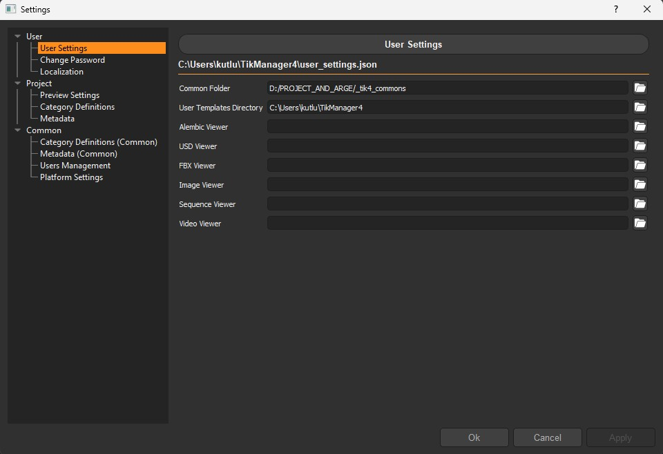
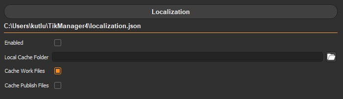

User Specific Settings
======================

User section contains settings that are specific to the user.
All permission levels have access to the this area.

There are currently three sub-sections:

.. _user_settings:

User Settings
~~~~~~~~~~~~~

From here the user can change the defined `Common Folder`,  user specific `User Templates Directory`
and executables for some file types.

.. tip:: 
    If the executables are not defined explicitly, the system defaults will be used instead.

.. _change_password:

Change Password
~~~~~~~~~~~~~~~

From here the user can change the password.

.. _localization:

Localization
~~~~~~~~~~~~

Localization is a feature introduced with version 4.3.0.
it allows users to set specific cache locations for work and publishes. 
This feature is particularly useful for teams working with cloud storage platforms like Google Drive or Dropbox,
helping to reduce data traffic and streamline uploads.

Files cached locally remain accessible to team members, who can still track progress, view thumbnails,
and access preview files. Cached works or publishes can be synced back to their original location at any time.

.. youtube:: 9cA5TeM7p1s
    :width: 680
    :height: 450

.. raw:: html

     

- **Enabled**: When enabled, the system will cache files locally.
- **Local Cache Folder**: The folder where the files will be cached.
- **Cache Work Files**: When enabled, the system will cache work files locally. Other users will be able to see the progress but won't be able to access these files until they are synced.
- **Cache Publish Files**: When enabled, the system will cache publish files locally. Other users will be able to see the progress but won't be able to access these files until they are synced.