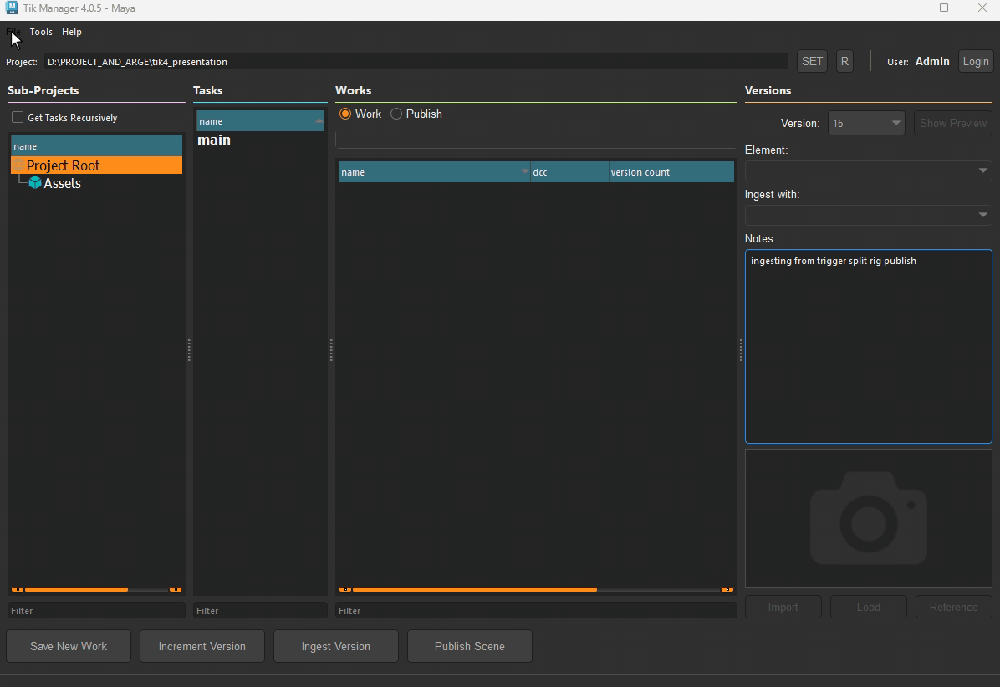
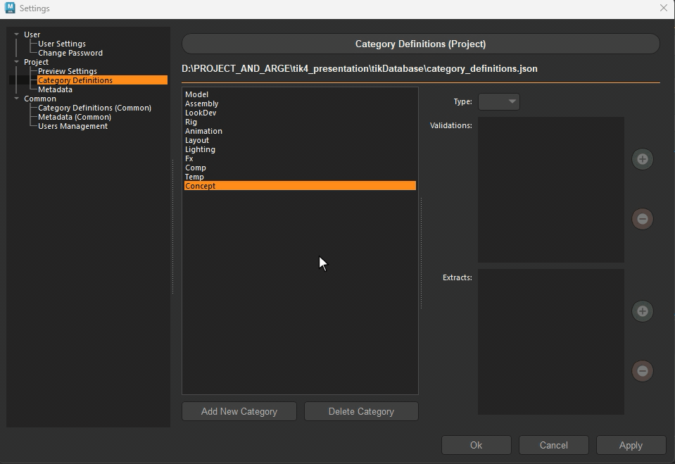

User Guide
==========

This section is work in progress.

.. _settings:

Settings
********

Setting menu is accessible from the `File -> Settings` menu. It is divided into 3 main sections:
  
User
----

User section contains settings that are specific to the user.
All permission levels have access to the this area.

There are currently two sub-sections:

- User Settings -> From here the user can change the defined `Common Folder`.
- Change Passrord -> From here the user can change the password.

Project
-------

Project section contains settings that are specific to the currently set project.
This area is only accessible to users with **Admin** permission level.

There are 3 sub-sections in the Project section:

- Preview Settings
- Category Definitions
- Metadata

Preview Settings
~~~~~~~~~~~~~~~~

.. note:: 
    *Not all of the settings listed in here available to all DCCs.*

Category Definitions
~~~~~~~~~~~~~~~~~~~~

This section is used to define the **Avaliable** categories for the project.
When a new task is created, only the categories defined here will be available for selection.

In addition to the category name, admins can define **Validations** and **Extracts** for each category from here.

**Adding a New Category:**
1. Click on the `Add New Category` button.
2. Enter the name of the category.
3. Click on the `Add` button.
4. Define the type of the category - Leave it blank to make it available to all types.

.. note::

    **Validations** are used to sanity check the data (usually scene) before publishing. TDs can define custom validators easily using the template provided. All validations are appear in the *add list* automatically.

.. note:: 

    **Extracts** are essential parts of publishes. They extract data and store it as an element along with the publish. Extracts can vary from a simple file copy to a complex data extraction from the scene. All extracts are appear in the *add list* automatically.

.. hint:: 

    An extract can produce a single file or a folder (bundle) with multiple files. An extract can also be used for other purposes such as sending a file to a server or dispatching an e-mail.

.. hint:: 

    Defining a category type will make it available only for that type of sub-projects. 
    For example, if we define a category as **asset**, it will only be available for the **asset tasks**.
    Leaving it blank will make it available for any task types.

**Adding Validations and Extracts:**

1. Select the category from the list.
2. Click on the `+` button next to the validation or extract area.
3. Select the validation(s) or extract(s) from the list.

.. attention::

    In the lists, **ALL** validations and extracts will appear for **ALL** available DCCs. However, during publish, depending on the DCC the not applicable ones will be pruned.
    For example, we can define *png* extract for the model category. This extract will be available for Photoshop publishes from the model category, but will not be available for Maya (unless there is a png extractor for Maya too.).

Metadata
~~~~~~~~

This section is used to define the **Avaliable** metadatas for the project.
When a new sub-project created, only the metadata defined here will be available for it.

To create a new metadata, click on the `Add New Metadata` button, select the value type
and enter the name of the metadata.

After creating the metadata, it is possible to assign a default value to it from the right side column.

.. hint:: 

    All Metadatas are passed down to the validatiors and extractors. 
    Any validator or extractor can use these metadatas to make decisions. For example, a validator
    for checking the animation ranges can use the `start_frame` and `end_frame` metadatas to determine the range.